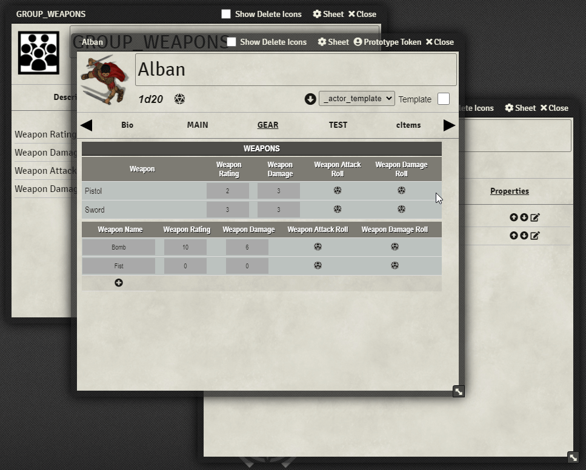
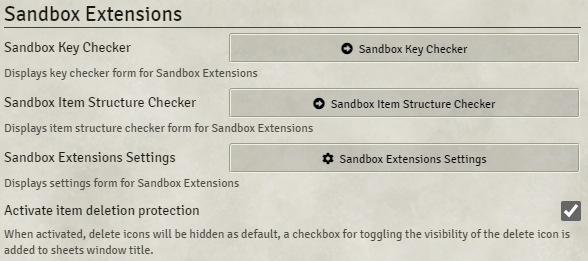
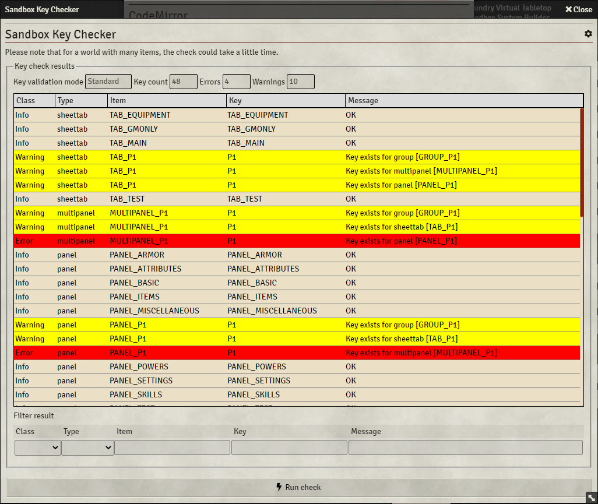
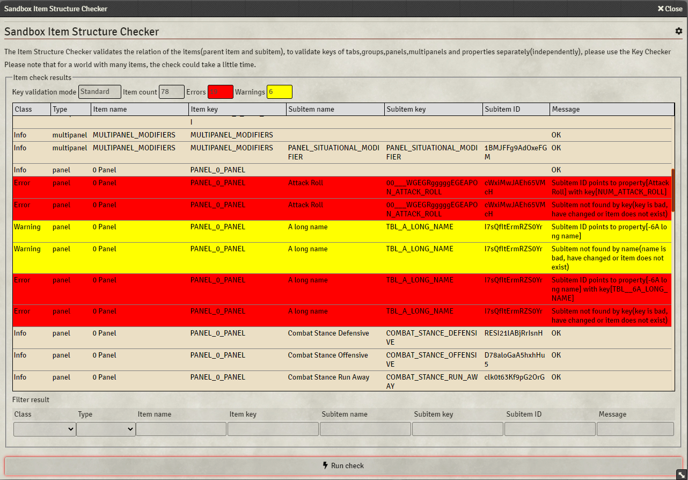

# Sandbox Extensions
A module for extending Sandbox functionality.  
[Foundry Packages Directory](https://foundryvtt.com/packages/sandbox-extensions)

## Installation
### Directly inside Foundry
Sandbox Extensions can be installed from Foundry´s configuration meny under "Add-on Module", and choose "Install module", filter package for "Sandbox Extensions"
### Manifest URL
https://raw.githubusercontent.com/Anderware/Foundry-Vtt-Sandbox-Macros/main/Modules/Sandbox-Extensions/releases/module.json

See here on help on how to use the manifest URL to install a module  
[Foundry Wiki - How to install module](https://foundryvtt.wiki/en/basics/Modules) 

## Version Compability
This module has been tested with the following versions

 Sandbox              | Foundry          
 -------------------- | ---------------- 
 0.11.0               | 0.8.9            
 0.10.12 0.10.11 | 0.8.9            
 0.10.1               | 0.8.9 0.8.8 

## Dependencies
Sandbox Extension requires the excellent module [CodeMirror for Foundry VTT](https://github.com/League-of-Foundry-Developers/codemirror-lib)

# Module Features
* Functions for auto generate values based on item name, item type(or property type) and configurable prefix/suffix/case for 
  * Key, Tag, Title, Tooltip, Font  Group, Input Group, Header Group, Roll ID, Roll Name  
* Function for validate input
  * Key valid name and if key is already in use  
  * Check Group
  * List(Options)
* Function for Autogenerate All/Validate All/Clear All 
* Expression Editor with syntax highlighting and bracket matching
  * Default, Roll Formula, Roll Name, Roll ID, Auto, Max(for simplenumerics properties), Check Group, List(Options)
* Functions for Cut/Copy/Paste for inputs
* Function for special Copy
  * Key as actor property
  * Key as cItem property
  * Key as dialog property
  * Font Group/Input Group/Header Group as CSS Rule Set
* Export Item data to clipboard as
  * HTML Table
  * Markdown Table
  * PlainText Table
* Item Delete Protection for Actor and Item sheets
  * Hides the Delete icon for table items, panel properties etc .
    Checkbox in window header to toggle visibillity for delete icons
* Option for Details as default tab for Properties/Panels/Multipanels/Groups/Tabs. Only for GMs
* Option for Attributes as default tab for cItems. Only for GMs 
* Option for adapt item sheets size and position based on content automatically on open. Only for GMs
* Option for automatic Latin conversion(transliteration) for key autogenerating support for many(!) alphabets(Using https://github.com/dzcpy/transliteration )
* Key Checker   
* Item Structure Checker
* Supports item types  
  * Property, Panel, Multipanel, Group, Tab, cItem
* All functions are optional and can be disabled in Settings
# Module Operations
## Basics

## Item Deletion Protection

## Item Structure & Key Checker

Open the Checkers by going by the Game Settings page, on the the Module tab  
  

### Key Checker

The Key Checker lists all Sandbox items and validates them according to the current validation mode.

Click an item in the result list to open the item.

To filter the results, use the filter controls on the bottom.

### Item Structure Checker

The Item Structure Checker validates the relation of the items(parent item and subitem)

Click an item in the result list to open the item.

To filter the results, use the filter controls on the bottom.

# Module Settings

| Setting                               | Description                                                  | Default     |
| ------------------------------------- | ------------------------------------------------------------ | ----------- |
| Activate item deletion protection     | When activated, delete icons will be hidden as default, a checkbox for toggling the visibility of the delete icon is added to sheets window title. | true        |
| Enforced key validation mode          | <b>Unchecked:</b> Sandbox standard - Keys are valid unless containing space, special characters or empty. Keys for can be duplicate between datatypes except panels/multipanels <b>Checked:</b> Enforced - Keys are valid if containing only A-Z, a-z,0-9,_(underscore) and not empty. Keys can not be duplicate between datatypes | false       |
| Show ID in sheet caption              | When checked, the item/actors ID will be shown in the sheets window title. Useful for debugging problem.  Applies for GMs only. | false       |
| Adapt item sheet size/position        | When checked, the starting size and position are adapted to item content.  Applies for GMs only. | true        |
| Override item default tab             | When checked, the default(starting) tab when an item is displayed is Details or Attributes(for cItems)  Applies for GMs only. | true        |
| Show item helpers                     | Show item helper menus on item sheets                        | true        |
| Confirm batch overwrite               | Ask user for confirmation before applying batch overwrite(Autogenerate All,Clear All) | true        |
| Convert key to case                   | Used for autogenerating key                                  | Upper case  |
| Convert CSS to case                   | Used for autogenerating CSS class                            | Lower case  |
| Transliterate non-latin characters    | When autogenerating key, any non-latin characters are transliterated into latin equivalents. When <b>Enforced key validation mode</b> is checked, transliteration will be executed regardless of this setting. <b>Please note that using non-latin characters as key might not work in roll expressions</b> | true        |
| Use prefix/suffix for autogenerating  | When autogenerating a field, add prefix and suffix           | true        |
| Use property data type for prefix     | When autogenerating a property key, use the propertys data type for prefix | true        |
| Prefix for property key               | Used for autogenerating property key when <b>Use property data type for prefix</b> is unchecked | PROPERTY    |
| Prefix for simpletext property key    | Used for autogenerating property key when <b>Use property data type for prefix</b> is checked | TXT         |
| Prefix for simplenumeric property key | Used for autogenerating property key when <b>Use property data type for prefix</b> is checked | NUM         |
| Prefix for checkbox property key      | Used for autogenerating property key when <b>Use property data type for prefix</b> is checked | CHK         |
| Prefix for radio property key         | Used for autogenerating property key when <b>Use property data type for prefix</b> is checked | RDO         |
| Prefix for textarea property key      | Used for autogenerating property key when <b>Use property data type for prefix</b> is checked | TXA         |
| Prefix for list property key          | Used for autogenerating property key when <b>Use property data type for prefix</b> is checked | LST         |
| Prefix for label property key         | Used for autogenerating property key when <b>Use property data type for prefix</b> is checked | LBL         |
| Prefix for badge property key         | Used for autogenerating property key when <b>Use property data type for prefix</b> is checked | BDG         |
| Prefix for property key               | Used for autogenerating property key when <b>Use property data type for prefix</b> is checked | TBL         |
| Prefix for button property key        | Used for autogenerating property key when <b>Use property data type for prefix</b> is checked | BTN         |
| Prefix for panel key                  | Used for autogenerating key                                  | PANEL       |
| Prefix for multipanel key             | Used for autogenerating key                                  | MULTIPANEL  |
| Prefix for group key                  | Used for autogenerating key                                  | GROUP       |
| Prefix for tab key                    | Used for autogenerating key                                  | TAB         |
| Suffix for item fontgroup             | Used for autogenerating CSS class                            | FONTGROUP   |
| Suffix for item inputgroup            | Used for autogenerating CSS class                            | INPUTGROUP  |
| Suffix for item headergroup           | Used for autogenerating CSS class                            | HEADERGROUP |
| Suffix for item roll id               | Used for autogenerating roll id                              | ROLL        |
| Suffix for item roll name             | Used for autogenerating roll name                            | Roll        |

