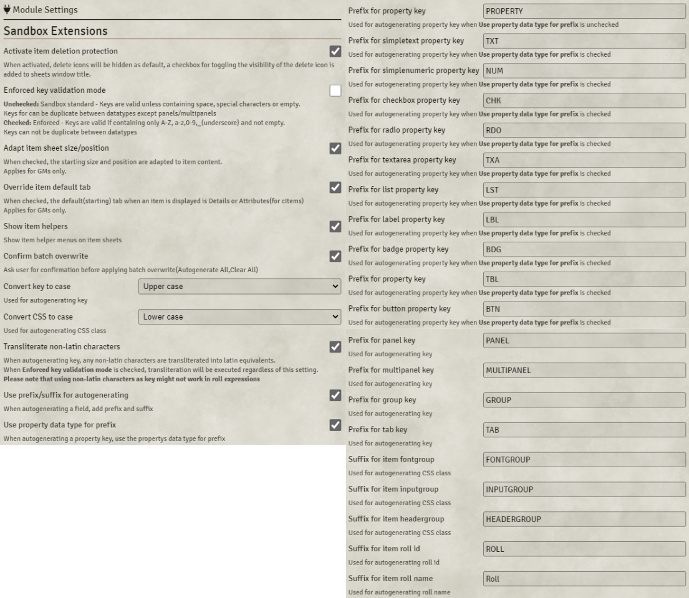

# Sandbox Extensions
A module for extending Sandbox functionality.  
[Foundry Packages Directory](https://foundryvtt.com/packages/sandbox-extensions)

## Installation
### Directly inside Foundry
Sandbox Extensions can be installed from Foundry´s configuration meny under "Add-on Module", and choose "Install module", filter package for "Sandbox Extensions"
### Manifest URL
https://raw.githubusercontent.com/Anderware/Foundry-Vtt-Sandbox-Macros/main/Modules/Sandbox-Extensions/releases/module.json

See here on help on how to use the manifest URL to install a module  
[Foundry Wiki - How to install module](https://foundryvtt.wiki/en/basics/Modules) 

## Version Compability
This module has been tested with the following versions

 Sandbox              | Foundry          
 -------------------- | ---------------- 
 0.10.12 0.10.11 | 0.8.9            
 0.10.1               | 0.8.9 0.8.8 

## Dependencies
Sandbox Extension requires the excellent module [CodeMirror for Foundry VTT](https://github.com/League-of-Foundry-Developers/codemirror-lib)

# Module Features
* Functions for auto generate values based on item name, item type(or property type) and configurable prefix/suffix/case for 
  * Key, Tag, Title, Tooltip, Font  Group, Input Group, Header Group, Roll ID, Roll Name  
* Function for validate input
  * Key valid name and if key is already in use  
  * Check Group
  * List(Options)
* Function for Autogenerate All/Validate All/Clear All 
* Expression Editor with syntax highlighting and bracket matching
  * Default, Roll Formula, Roll Name, Roll ID, Auto, Max(for simplenumerics properties), Check Group, List(Options)
* Functions for Cut/Copy/Paste for inputs
* Function for special Copy
  * Key as actor property
  * Key as cItem property
  * Key as dialog property
  * Font Group/Input Group/Header Group as CSS Rule Set
* Export Item data to clipboard as
  * HTML Table
  * Markdown Table
  * PlainText Table
* Item Delete Protection for Actor and Item sheets
  * Hides the Delete icon for table items, panel properties etc .
    Checkbox in window header to toggle visibillity for delete icons
* Option for Details as default tab for Properties/Panels/Multipanels/Groups/Tabs. Only for GMs
* Option for Attributes as default tab for cItems. Only for GMs 
* Option for adapt item sheets size and position based on content automatically on open. Only for GMs
* Option for automatic Latin conversion(transliteration) for key autogenerating support for many(!) alphabets(Using https://github.com/dzcpy/transliteration )
* Key Checker   
* Supports item types  
  * Property, Panel, Multipanel, Group, Tab, cItem
* All functions are optional and can be disabled in Settings
# Module Operations
## Basics

## Item Deletion Protection

## Key Checker

The Key Checker lists all Sandbox items and validates them according to the current validation mode.
Open the Key Checker by going by the Game Settings page, on the the Module tab  
  

Click an item in the result list to open the item.

To filter the results, use the filter controls on the bottom.
# Module Settings

